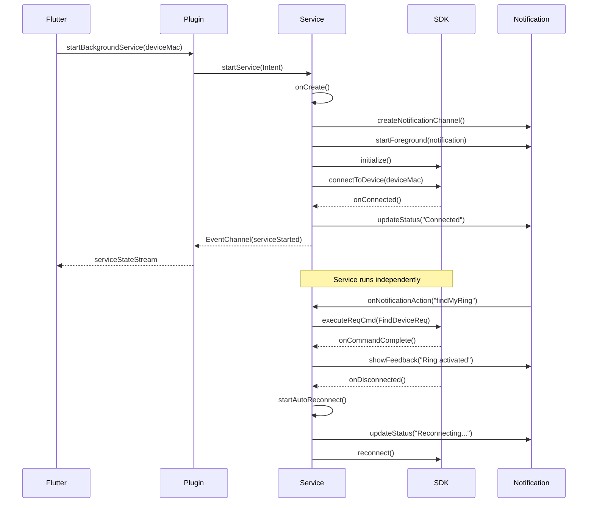

# Design Document: Background Service with Persistent Notification

## Overview

This design implements an Android Foreground Service that maintains continuous communication with the QRing smart ring device, independent of the Flutter app lifecycle. The service provides a persistent notification with actionable features, enabling users to interact with their ring without opening the app. The implementation follows Android best practices for foreground services, battery optimization, and Android 12+ compatibility.

## Architecture

### High-Level Architecture

```
┌─────────────────────────────────────────────────────────────┐
│                      Flutter App (Dart)                      │
│  ┌────────────────┐  ┌──────────────┐  ┌─────────────────┐ │
│  │  UI Screens    │  │MethodChannel │  │  EventChannel   │ │
│  └────────────────┘  └──────────────┘  └─────────────────┘ │
└──────────────────────────┬──────────────────┬───────────────┘
                           │                  │
                           ▼                  ▼
┌─────────────────────────────────────────────────────────────┐
│              QringSdkFlutterPlugin (Java)                    │
│  ┌──────────────────────────────────────────────────────┐  │
│  │         Service Control Methods                       │  │
│  │  - startBackgroundService()                          │  │
│  │  - stopBackgroundService()                           │  │
│  │  - isServiceRunning()                                │  │
│  │  - sendRingCommand()                                 │  │
│  └──────────────────────────────────────────────────────┘  │
└──────────────────────────┬──────────────────────────────────┘
                           │
                           ▼
┌─────────────────────────────────────────────────────────────┐
│           QRingBackgroundService (Foreground Service)        │
│  ┌──────────────────────────────────────────────────────┐  │
│  │  Service Lifecycle                                    │  │
│  │  - onCreate()                                         │  │
│  │  - onStartCommand() → START_STICKY                   │  │
│  │  - onDestroy()                                        │  │
│  └──────────────────────────────────────────────────────┘  │
│  ┌──────────────────────────────────────────────────────┐  │
│  │  Connection Manager                                   │  │
│  │  - connectToDevice()                                  │  │
│  │  - handleDisconnection()                              │  │
│  │  - autoReconnect()                                    │  │
│  └──────────────────────────────────────────────────────┘  │
│  ┌──────────────────────────────────────────────────────┐  │
│  │  Notification Manager                                 │  │
│  │  - createNotificationChannel()                        │  │
│  │  - buildNotification()                                │  │
│  │  - updateNotificationStatus()                         │  │
│  └──────────────────────────────────────────────────────┘  │
│  ┌──────────────────────────────────────────────────────┐  │
│  │  Command Handler                                      │  │
│  │  - handleFindMyRing()                                 │  │
│  │  - handleCustomCommand()                              │  │
│  └──────────────────────────────────────────────────────┘  │
└──────────────────────────┬──────────────────────────────────┘
                           │
                           ▼
┌─────────────────────────────────────────────────────────────┐
│                  QRing SDK (qring_sdk_1.0.0.4.aar)          │
│  - BleScannerHelper                                          │
│  - BleOperateManager                                         │
│  - CommandHandle                                             │
│  - LargeDataHandler                                          │
└─────────────────────────────────────────────────────────────┘
```

### Component Interaction Flow



## Components and Interfaces

### 1. QRingBackgroundService (Android Service)

**Purpose:** Main foreground service that manages ring connectivity and notification.

**Key Methods:**
```java
public class QRingBackgroundService extends Service {
    // Lifecycle
    @Override
    public void onCreate()
    @Override
    public int onStartCommand(Intent intent, int flags, int startId)
    @Override
    public void onDestroy()
    @Override
    public IBinder onBind(Intent intent)
    
    // Connection Management
    private void connectToDevice(String deviceMac)
    private void disconnectDevice()
    private void handleDisconnection()
    private void startAutoReconnect()
    private void stopAutoReconnect()
    
    // Notification Management
    private void createNotificationChannel()
    private Notification buildNotification(String status)
    private void updateNotification(String status)
    
    // Command Handling
    private void handleFindMyRing()
    private void handleCommand(String command, Map<String, Object> params)
    
    // State Management
    private void saveConnectionState(String deviceMac)
    private String loadSavedDeviceMac()
    private void clearSavedState()
}
```

**State Variables:**
- `deviceMac`: Currently connected device MAC address
- `isConnected`: Current connection state
- `reconnectAttempts`: Number of consecutive reconnection failures
- `reconnectHandler`: Handler for scheduling reconnection attempts
- `bleOperateManager`: QRing SDK BLE manager instance
- `notificationManager`: Android NotificationManager
- `sharedPreferences`: For persisting state

### 2. ServiceNotificationManager (Helper Class)

**Purpose:** Manages notification creation, updates, and actions.

**Key Methods:**
```java
public class ServiceNotificationManager {
    public void createNotificationChannel(Context context)
    public Notification buildNotification(
        Context context,
        String title,
        String message,
        String status,
        boolean showFindMyRingAction
    )
    public void updateNotification(int notificationId, Notification notification)
    public PendingIntent createFindMyRingIntent(Context context)
    public PendingIntent createOpenAppIntent(Context context)
}
```

**Notification Structure:**
- **Channel ID:** "qring_service_channel"
- **Channel Name:** "Smart Ring Service"
- **Importance:** IMPORTANCE_LOW (persistent but not intrusive)
- **Icon:** App icon
- **Title:** "Smart Ring Connected" / "Smart Ring Disconnected"
- **Text:** Connection status and device name
- **Actions:**
  - "Find My Ring" button (when connected)
  - Tap to open app (content intent)

### 3. ServiceConnectionManager (Helper Class)

**Purpose:** Handles connection logic, reconnection, and state management.

**Key Methods:**
```java
public class ServiceConnectionManager {
    public void connect(String deviceMac, ConnectionCallback callback)
    public void disconnect()
    public void startAutoReconnect(String deviceMac)
    public void stopAutoReconnect()
    public boolean isConnected()
    
    // Reconnection Strategy
    private void scheduleReconnect(int attemptNumber)
    private int calculateBackoffDelay(int attemptNumber)
    
    // Callbacks
    interface ConnectionCallback {
        void onConnected(String deviceMac);
        void onDisconnected();
        void onConnectionFailed(String error);
    }
}
```

**Reconnection Strategy:**
- Initial retry interval: 10 seconds
- After 5 failures: 30 seconds
- After 10 failures: 60 seconds
- Maximum retry interval: 5 minutes
- Exponential backoff with jitter to prevent thundering herd

### 4. ServiceCommandHandler (Helper Class)

**Purpose:** Processes commands from notification actions and Flutter.

**Key Methods:**
```java
public class ServiceCommandHandler {
    public void handleFindMyRing(CommandCallback callback)
    public void handleCustomCommand(String command, Map<String, Object> params, CommandCallback callback)
    
    interface CommandCallback {
        void onSuccess(Map<String, Object> result);
        void onError(String errorCode, String errorMessage);
    }
}
```

### 5. NotificationActionReceiver (BroadcastReceiver)

**Purpose:** Receives and processes notification action button taps.

**Key Methods:**
```java
public class NotificationActionReceiver extends BroadcastReceiver {
    @Override
    public void onReceive(Context context, Intent intent) {
        String action = intent.getAction();
        if (ACTION_FIND_MY_RING.equals(action)) {
            // Send command to service
            Intent serviceIntent = new Intent(context, QRingBackgroundService.class);
            serviceIntent.setAction(ACTION_FIND_MY_RING);
            context.startService(serviceIntent);
        }
    }
}
```

**Actions:**
- `ACTION_FIND_MY_RING`: Trigger Find My Ring command
- `ACTION_OPEN_APP`: Open Flutter app (handled by content intent)

### 6. Flutter Plugin Integration (QringSdkFlutterPlugin)

**New MethodChannel Methods:**
```dart
// Start the background service
Future<void> startBackgroundService(String deviceMac)

// Stop the background service
Future<void> stopBackgroundService()

// Check if service is running
Future<bool> isServiceRunning()

// Send command to service (for future extensibility)
Future<Map<String, dynamic>> sendRingCommand(String command, Map<String, dynamic> params)
```

**New EventChannel:**
```dart
// Stream of service state changes
Stream<Map<String, dynamic>> get serviceStateStream
```

**Event Types:**
- `serviceStarted`: Service has started
- `serviceStopped`: Service has stopped
- `deviceConnected`: Ring connected
- `deviceDisconnected`: Ring disconnected
- `commandExecuted`: Command completed (with result)

## Data Models

### ServiceState

```dart
class ServiceState {
  final bool isRunning;
  final bool isConnected;
  final String? deviceMac;
  final String? deviceName;
  final int reconnectAttempts;
  final DateTime? lastConnectedTime;
  
  ServiceState({
    required this.isRunning,
    required this.isConnected,
    this.deviceMac,
    this.deviceName,
    this.reconnectAttempts = 0,
    this.lastConnectedTime,
  });
  
  Map<String, dynamic> toMap() {
    return {
      'isRunning': isRunning,
      'isConnected': isConnected,
      'deviceMac': deviceMac,
      'deviceName': deviceName,
      'reconnectAttempts': reconnectAttempts,
      'lastConnectedTime': lastConnectedTime?.toIso8601String(),
    };
  }
  
  factory ServiceState.fromMap(Map<String, dynamic> map) {
    return ServiceState(
      isRunning: map['isRunning'] as bool,
      isConnected: map['isConnected'] as bool,
      deviceMac: map['deviceMac'] as String?,
      deviceName: map['deviceName'] as String?,
      reconnectAttempts: map['reconnectAttempts'] as int? ?? 0,
      lastConnectedTime: map['lastConnectedTime'] != null
          ? DateTime.parse(map['lastConnectedTime'] as String)
          : null,
    );
  }
}
```

### ServiceCommand

```dart
class ServiceCommand {
  final String command;
  final Map<String, dynamic> params;
  
  ServiceCommand({
    required this.command,
    this.params = const {},
  });
  
  Map<String, dynamic> toMap() {
    return {
      'command': command,
      'params': params,
    };
  }
}
```

### NotificationConfig

```java
public class NotificationConfig {
    public static final String CHANNEL_ID = "qring_service_channel";
    public static final String CHANNEL_NAME = "Smart Ring Service";
    public static final int NOTIFICATION_ID = 1001;
    
    public static final String ACTION_FIND_MY_RING = "com.example.qring_sdk_flutter.FIND_MY_RING";
    public static final String ACTION_OPEN_APP = "com.example.qring_sdk_flutter.OPEN_APP";
    
    public static final String EXTRA_DEVICE_MAC = "device_mac";
    public static final String EXTRA_COMMAND = "command";
}
```

## Correctness Properties

*A property is a characteristic or behavior that should hold true across all valid executions of a system—essentially, a formal statement about what the system should do. Properties serve as the bridge between human-readable specifications and machine-verifiable correctness guarantees.*

### Property 1: Service Lifecycle Independence
*For any* Flutter app state (running, paused, killed), when the background service is started, the service should continue running and maintain ring connectivity.
**Validates: Requirements 1.1, 1.3**

### Property 2: Automatic Service Restart
*For any* system-initiated service termination, the service should automatically restart within a reasonable time period (< 30 seconds) and attempt to reconnect to the saved device.
**Validates: Requirements 1.4, 1.5**

### Property 3: Notification Persistence
*For any* service state (connected, disconnected, reconnecting), a notification should be visible in the notification bar with appropriate status text.
**Validates: Requirements 3.2, 3.6, 3.7**

### Property 4: Find My Ring Action Availability
*For any* connected device state, the "Find My Ring" action button should be present in the notification and functional without requiring the Flutter app to be running.
**Validates: Requirements 4.1, 4.2, 4.3**

### Property 5: Connection State Synchronization
*For any* connection state change (connected, disconnected), both the service and the Flutter app (if running) should reflect the same state within 1 second.
**Validates: Requirements 6.5, 7.1**

### Property 6: Reconnection Backoff
*For any* sequence of failed reconnection attempts, the delay between attempts should increase exponentially up to a maximum of 5 minutes.
**Validates: Requirements 7.1, 7.2, 7.3, 9.2**

### Property 7: Bluetooth State Handling
*For any* Bluetooth state change (enabled/disabled), the service should pause reconnection when disabled and resume immediately when re-enabled.
**Validates: Requirements 7.4, 7.5**

### Property 8: Permission Validation
*For any* required permission (Bluetooth, notifications), if the permission is not granted, the service should display an error notification and stop gracefully.
**Validates: Requirements 8.2, 8.3, 8.4, 8.5**

### Property 9: State Persistence Round Trip
*For any* connected device, saving the device MAC address and then restarting the service should result in an automatic reconnection attempt to the same device.
**Validates: Requirements 11.1, 11.2, 11.3**

### Property 10: Error Recovery
*For any* QRing SDK exception, the service should catch the exception, log it, and continue running without crashing.
**Validates: Requirements 10.1, 10.2, 10.6**

### Property 11: Command Execution Validation
*For any* ring command (Find My Ring, custom command), the command should only execute when the device is connected, otherwise return an error.
**Validates: Requirements 4.6, 12.3**

### Property 12: Notification Action Feedback
*For any* notification action execution (success or failure), the notification should update to show feedback within 2 seconds.
**Validates: Requirements 4.4, 4.5, 12.4**

### Property 13: Service State Query Accuracy
*For any* time when Flutter calls isServiceRunning(), the returned value should accurately reflect whether the service is currently active.
**Validates: Requirements 6.3**

### Property 14: Resource Cleanup
*For any* service termination (manual stop or crash), all QRing SDK resources should be properly released before the service stops.
**Validates: Requirements 2.6, 10.5**

### Property 15: Battery Optimization Compliance
*For any* idle period (no active operations), the service should not hold wake locks and should use minimal CPU resources.
**Validates: Requirements 9.1, 9.5**

## Error Handling

### Error Categories

1. **Connection Errors**
   - Device not found
   - Connection timeout
   - Bluetooth disabled
   - Device out of range

2. **Permission Errors**
   - Bluetooth permission denied
   - Notification permission denied (Android 13+)
   - Location permission denied (required for BLE scanning)

3. **SDK Errors**
   - SDK initialization failure
   - Command execution failure
   - Unexpected SDK exception

4. **System Errors**
   - Low memory
   - Service killed by system
   - Notification channel creation failure

### Error Handling Strategy

```java
try {
    // Execute operation
    bleOperateManager.executeCommand(command);
} catch (BluetoothException e) {
    // Handle Bluetooth-specific errors
    Log.e(TAG, "Bluetooth error: " + e.getMessage());
    updateNotification("Bluetooth error - Retrying...");
    scheduleReconnect();
} catch (SecurityException e) {
    // Handle permission errors
    Log.e(TAG, "Permission error: " + e.getMessage());
    updateNotification("Permission required");
    stopSelf();
} catch (Exception e) {
    // Handle unexpected errors
    Log.e(TAG, "Unexpected error: " + e.getMessage());
    reinitializeSDK();
}
```

### Error Notification Strategy

- **Transient errors:** Update notification with retry message
- **Permission errors:** Show notification with action to open settings
- **Critical errors:** Show error notification and stop service
- **All errors:** Log to Android logcat for debugging

## Testing Strategy

### Unit Tests

1. **ServiceConnectionManager Tests**
   - Test connection success/failure scenarios
   - Test reconnection backoff calculation
   - Test Bluetooth state change handling

2. **ServiceNotificationManager Tests**
   - Test notification channel creation
   - Test notification building with different states
   - Test pending intent creation

3. **ServiceCommandHandler Tests**
   - Test Find My Ring command execution
   - Test command validation (connected vs disconnected)
   - Test error handling for failed commands

4. **State Persistence Tests**
   - Test saving device MAC to SharedPreferences
   - Test loading saved device MAC
   - Test clearing saved state

### Property-Based Tests

Each correctness property should be implemented as a property-based test:

1. **Property 1: Service Lifecycle Independence**
   - Generate random app states (running, killed, background)
   - Start service and verify it continues running
   - Kill app and verify service remains active

2. **Property 6: Reconnection Backoff**
   - Generate random number of failed attempts (1-20)
   - Verify delay increases exponentially
   - Verify maximum delay cap is respected

3. **Property 9: State Persistence Round Trip**
   - Generate random device MAC addresses
   - Save, restart service, verify reconnection attempt

4. **Property 10: Error Recovery**
   - Generate random SDK exceptions
   - Verify service catches and continues running

### Integration Tests

1. **End-to-End Service Test**
   - Start service from Flutter
   - Verify notification appears
   - Tap "Find My Ring" action
   - Verify command executes
   - Stop service from Flutter
   - Verify notification disappears

2. **Reconnection Test**
   - Start service and connect device
   - Simulate device disconnection
   - Verify automatic reconnection attempts
   - Verify notification status updates

3. **App Lifecycle Test**
   - Start service from app
   - Kill app
   - Verify service continues
   - Tap notification
   - Verify app launches

### Manual Testing Checklist

- [ ] Service starts and shows notification
- [ ] "Find My Ring" works from notification
- [ ] Service survives app being killed
- [ ] Service restarts after system kill
- [ ] Reconnection works after disconnection
- [ ] Bluetooth off/on handling works
- [ ] Notification tap opens app
- [ ] Service stops cleanly
- [ ] Works on Android 12+
- [ ] Battery usage is reasonable

## Implementation Notes

### Android Manifest Changes

```xml
<manifest>
    <!-- Permissions -->
    <uses-permission android:name="android.permission.FOREGROUND_SERVICE" />
    <uses-permission android:name="android.permission.FOREGROUND_SERVICE_CONNECTED_DEVICE" />
    <uses-permission android:name="android.permission.POST_NOTIFICATIONS" />
    <uses-permission android:name="android.permission.BLUETOOTH_CONNECT" />
    <uses-permission android:name="android.permission.BLUETOOTH_SCAN" />
    
    <application>
        <!-- Service Declaration -->
        <service
            android:name=".QRingBackgroundService"
            android:enabled="true"
            android:exported="false"
            android:foregroundServiceType="connectedDevice" />
        
        <!-- Broadcast Receiver for Notification Actions -->
        <receiver
            android:name=".NotificationActionReceiver"
            android:enabled="true"
            android:exported="false">
            <intent-filter>
                <action android:name="com.example.qring_sdk_flutter.FIND_MY_RING" />
            </intent-filter>
        </receiver>
    </application>
</manifest>
```

### Gradle Dependencies

No additional dependencies required beyond existing QRing SDK.

### Flutter Integration Example

```dart
// Start service
await QringSdkFlutter.instance.startBackgroundService(deviceMac);

// Listen to service state
QringSdkFlutter.instance.serviceStateStream.listen((state) {
  print('Service state: ${state['isConnected']}');
});

// Stop service
await QringSdkFlutter.instance.stopBackgroundService();

// Check if running
bool isRunning = await QringSdkFlutter.instance.isServiceRunning();
```

### Performance Considerations

1. **Battery Impact:**
   - Foreground service with persistent notification: ~2-5% battery per day
   - BLE connection maintenance: ~1-2% battery per day
   - Reconnection attempts: Minimal impact with exponential backoff

2. **Memory Usage:**
   - Service base: ~10-15 MB
   - QRing SDK: ~5-10 MB
   - Total: ~15-25 MB (acceptable for foreground service)

3. **CPU Usage:**
   - Idle: < 1% CPU
   - Active operations: 2-5% CPU
   - Reconnection: Brief spikes during attempts

### Security Considerations

1. **Notification Actions:**
   - Use PendingIntent with FLAG_IMMUTABLE (Android 12+)
   - Validate all intents before processing

2. **State Persistence:**
   - Store only device MAC address (no sensitive data)
   - Use MODE_PRIVATE for SharedPreferences

3. **Permissions:**
   - Request runtime permissions before starting service
   - Handle permission denial gracefully

## Future Enhancements

1. **Additional Notification Actions:**
   - Quick battery check
   - Toggle continuous monitoring
   - View recent health data

2. **Advanced Reconnection:**
   - Geofencing-based reconnection
   - Wi-Fi/cellular-aware reconnection strategy

3. **Multi-Device Support:**
   - Connect to multiple rings simultaneously
   - Switch between devices from notification

4. **Wear OS Integration:**
   - Companion app for Wear OS
   - Quick actions from smartwatch
