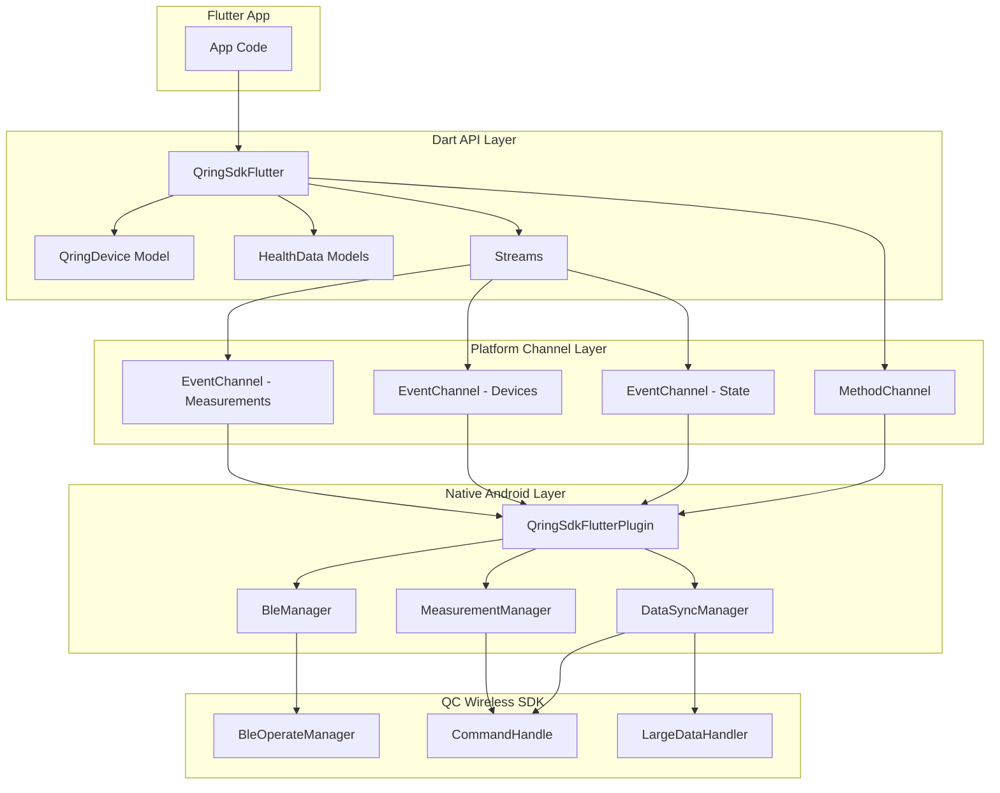

# Design Document

## Overview

This design document describes the architecture and implementation approach for the QC Wireless SDK Flutter plugin. The plugin provides a comprehensive Flutter API that wraps the native Android QC Wireless SDK, enabling Flutter applications to communicate with QC smart ring devices via Bluetooth Low Energy (BLE).

The design follows a layered architecture with clear separation between the Dart API layer, platform channel communication layer, and native SDK integration layer. This approach ensures maintainability, testability, and ease of future enhancements.

## Architecture

The plugin architecture consists of three primary layers:

### Layer 1: Dart API Layer
- Public-facing Flutter API exposed to app developers
- Provides type-safe Dart classes and methods
- Handles serialization/deserialization of data between Dart and native platforms
- Manages streams for real-time data and events

### Layer 2: Platform Channel Layer
- Method channels for request-response communication
- Event channels for streaming data from native to Dart
- Message encoding/decoding using StandardMessageCodec
- Error propagation from native to Dart

### Layer 3: Native SDK Integration Layer (Android)
- Wraps the QC Wireless SDK (qring_sdk_1.0.0.4.aar)
- Implements MethodCallHandler for processing Dart method calls
- Implements EventChannel.StreamHandler for streaming data
- Manages SDK lifecycle and state




## Components and Interfaces

### Dart Layer Components

#### QringSdkFlutter (Main API Class)
Primary interface for all plugin functionality.

**Methods:**
- `Future<void> initialize()` - Initialize the SDK
- `Future<void> startScan()` - Begin BLE device scanning
- `Future<void> stopScan()` - Stop BLE device scanning
- `Future<void> connect(String macAddress)` - Connect to a device
- `Future<void> disconnect()` - Disconnect from current device
- `Future<void> findRing()` - Trigger find my ring feature
- `Future<int> getBattery()` - Get battery level (0-100)
- `Future<QringDeviceInfo> getDeviceInfo()` - Get device information
- `Future<void> factoryReset()` - Reset device to factory settings

**Streams:**
- `Stream<ConnectionState> get connectionStateStream` - Connection status updates
- `Stream<List<QringDevice>> get devicesStream` - Discovered devices
- `Stream<HealthMeasurement> get measurementStream` - Real-time measurements


#### QringHealthData (Health Data API)
Manages health data synchronization and manual measurements.

**Methods:**
- `Future<StepData> syncStepData(int dayOffset)` - Sync step data
- `Future<List<HeartRateData>> syncHeartRateData(int dayOffset)` - Sync heart rate
- `Future<SleepData> syncSleepData(int dayOffset)` - Sync sleep data
- `Future<List<BloodOxygenData>> syncBloodOxygenData(int dayOffset)` - Sync SpO2
- `Future<List<BloodPressureData>> syncBloodPressureData(int dayOffset)` - Sync BP
- `Future<void> startHeartRateMeasurement()` - Start manual HR measurement
- `Future<void> startBloodPressureMeasurement()` - Start manual BP measurement
- `Future<void> startBloodOxygenMeasurement()` - Start manual SpO2 measurement
- `Future<void> startTemperatureMeasurement()` - Start manual temp measurement
- `Future<void> stopMeasurement()` - Stop active measurement

#### QringSettings (Device Settings API)
Manages device configuration and settings.

**Methods:**
- `Future<void> setContinuousHeartRate(bool enable, int intervalMinutes)` - Configure continuous HR
- `Future<ContinuousHeartRateSettings> getContinuousHeartRateSettings()` - Read HR settings
- `Future<void> setContinuousBloodOxygen(bool enable, int intervalMinutes)` - Configure continuous SpO2
- `Future<void> setContinuousBloodPressure(bool enable)` - Configure continuous BP
- `Future<void> setDisplaySettings(DisplaySettings settings)` - Configure display
- `Future<DisplaySettings> getDisplaySettings()` - Read display settings
- `Future<void> setUserInfo(UserInfo userInfo)` - Set user profile
- `Future<void> setUserId(String userId)` - Set user ID

#### QringExercise (Exercise Tracking API)
Manages exercise sessions and workout tracking.

**Methods:**
- `Future<void> startExercise(ExerciseType type)` - Start exercise session
- `Future<void> pauseExercise()` - Pause active session
- `Future<void> resumeExercise()` - Resume paused session
- `Future<ExerciseSummary> stopExercise()` - End session and get summary
- `Stream<ExerciseData> get exerciseDataStream` - Real-time exercise data

#### QringFirmware (Firmware Update API)
Manages firmware updates.

**Methods:**
- `Future<bool> validateFirmwareFile(String filePath)` - Validate firmware file
- `Future<void> startFirmwareUpdate(String filePath)` - Start DFU update
- `Stream<int> get updateProgressStream` - Update progress (0-100)


## Data Models

### QringDevice
Represents a discovered BLE device.

```dart
class QringDevice {
  final String name;
  final String macAddress;
  final int rssi;
  
  QringDevice({
    required this.name,
    required this.macAddress,
    required this.rssi,
  });
  
  factory QringDevice.fromMap(Map<String, dynamic> map);
  Map<String, dynamic> toMap();
}
```

### QringDeviceInfo
Contains device information and capabilities.

```dart
class QringDeviceInfo {
  final String firmwareVersion;
  final String hardwareVersion;
  final bool supportsTemperature;
  final bool supportsBloodOxygen;
  final bool supportsBloodPressure;
  final bool supportsHrv;
  final bool supportsOneKeyCheck;
  
  QringDeviceInfo({
    required this.firmwareVersion,
    required this.hardwareVersion,
    required this.supportsTemperature,
    required this.supportsBloodOxygen,
    required this.supportsBloodPressure,
    required this.supportsHrv,
    required this.supportsOneKeyCheck,
  });
  
  factory QringDeviceInfo.fromMap(Map<String, dynamic> map);
}
```

### StepData
Daily step count, distance, and calorie data.

```dart
class StepData {
  final DateTime date;
  final int totalSteps;
  final int runningSteps;
  final int calories;
  final int distanceMeters;
  final int sportDurationSeconds;
  final int sleepDurationSeconds;
  
  StepData({
    required this.date,
    required this.totalSteps,
    required this.runningSteps,
    required this.calories,
    required this.distanceMeters,
    required this.sportDurationSeconds,
    required this.sleepDurationSeconds,
  });
  
  factory StepData.fromMap(Map<String, dynamic> map);
}
```

### HeartRateData
Heart rate measurement data.

```dart
class HeartRateData {
  final DateTime timestamp;
  final int heartRate;
  
  HeartRateData({
    required this.timestamp,
    required this.heartRate,
  });
  
  factory HeartRateData.fromMap(Map<String, dynamic> map);
}
```


### SleepData
Sleep stage and duration data.

```dart
enum SleepStage {
  notSleeping,
  removed,
  lightSleep,
  deepSleep,
  rem,
  awake,
}

class SleepDetail {
  final int durationMinutes;
  final SleepStage stage;
  
  SleepDetail({
    required this.durationMinutes,
    required this.stage,
  });
}

class SleepData {
  final DateTime startTime;
  final DateTime endTime;
  final List<SleepDetail> details;
  final bool hasLunchBreak;
  final DateTime? lunchStartTime;
  final DateTime? lunchEndTime;
  
  SleepData({
    required this.startTime,
    required this.endTime,
    required this.details,
    this.hasLunchBreak = false,
    this.lunchStartTime,
    this.lunchEndTime,
  });
  
  factory SleepData.fromMap(Map<String, dynamic> map);
}
```

### BloodPressureData
Blood pressure measurement data.

```dart
class BloodPressureData {
  final DateTime timestamp;
  final int systolic;
  final int diastolic;
  
  BloodPressureData({
    required this.timestamp,
    required this.systolic,
    required this.diastolic,
  });
  
  factory BloodPressureData.fromMap(Map<String, dynamic> map);
}
```

### BloodOxygenData
Blood oxygen saturation data.

```dart
class BloodOxygenData {
  final DateTime timestamp;
  final int spO2;
  
  BloodOxygenData({
    required this.timestamp,
    required this.spO2,
  });
  
  factory BloodOxygenData.fromMap(Map<String, dynamic> map);
}
```

### HealthMeasurement
Real-time measurement result.

```dart
enum MeasurementType {
  heartRate,
  bloodPressure,
  bloodOxygen,
  temperature,
  pressure,
  hrv,
}

class HealthMeasurement {
  final MeasurementType type;
  final DateTime timestamp;
  final int? heartRate;
  final int? systolic;
  final int? diastolic;
  final int? spO2;
  final double? temperature;
  final int? pressure;
  final int? hrv;
  final bool success;
  final String? errorMessage;
  
  HealthMeasurement({
    required this.type,
    required this.timestamp,
    this.heartRate,
    this.systolic,
    this.diastolic,
    this.spO2,
    this.temperature,
    this.pressure,
    this.hrv,
    required this.success,
    this.errorMessage,
  });
  
  factory HealthMeasurement.fromMap(Map<String, dynamic> map);
}
```


### ConnectionState
Represents the current connection status.

```dart
enum ConnectionState {
  disconnected,
  connecting,
  connected,
  disconnecting,
}
```

### DisplaySettings
Ring display configuration.

```dart
class DisplaySettings {
  final bool enabled;
  final bool leftHand;
  final int brightness;
  final int maxBrightness;
  final bool doNotDisturb;
  final int screenOnStartMinutes;
  final int screenOnEndMinutes;
  
  DisplaySettings({
    required this.enabled,
    required this.leftHand,
    required this.brightness,
    required this.maxBrightness,
    required this.doNotDisturb,
    required this.screenOnStartMinutes,
    required this.screenOnEndMinutes,
  });
  
  factory DisplaySettings.fromMap(Map<String, dynamic> map);
  Map<String, dynamic> toMap();
}
```

### UserInfo
User profile information.

```dart
class UserInfo {
  final int age;
  final int heightCm;
  final int weightKg;
  final bool isMale;
  
  UserInfo({
    required this.age,
    required this.heightCm,
    required this.weightKg,
    required this.isMale,
  });
  
  Map<String, dynamic> toMap();
}
```

### ExerciseType
Supported exercise types.

```dart
enum ExerciseType {
  walking,
  running,
  cycling,
  hiking,
  swimming,
  yoga,
  // ... additional types from SDK
}
```

### ExerciseData
Real-time exercise metrics.

```dart
class ExerciseData {
  final int durationSeconds;
  final int heartRate;
  final int steps;
  final int distanceMeters;
  final int calories;
  
  ExerciseData({
    required this.durationSeconds,
    required this.heartRate,
    required this.steps,
    required this.distanceMeters,
    required this.calories,
  });
  
  factory ExerciseData.fromMap(Map<String, dynamic> map);
}
```


## Correctness Properties

A property is a characteristic or behavior that should hold true across all valid executions of a system—essentially, a formal statement about what the system should do. Properties serve as the bridge between human-readable specifications and machine-verifiable correctness guarantees.

### Property 1: Scan Invocation Triggers Native Scan
*For any* invocation of the scan() method, the Flutter plugin should call the native SDK's BleScannerHelper.getInstance().scanDevice() method.
**Validates: Requirements 1.1**

### Property 2: Discovered Devices Appear in Stream
*For any* QC Ring device discovered during scanning, the device information (name, MAC address, RSSI) should be emitted through the devicesStream.
**Validates: Requirements 1.2, 1.4**

### Property 3: Stop Scan Terminates Scanning
*For any* invocation of stopScan(), the Flutter plugin should call the native SDK's BleScannerHelper.getInstance().stopScan() method and scanning should cease.
**Validates: Requirements 1.3**

### Property 4: Connect Establishes Connection
*For any* valid MAC address provided to connect(), the Flutter plugin should call the native SDK's BleOperateManager.getInstance().connectDirectly() or connectWithScan() method.
**Validates: Requirements 2.1**

### Property 5: Successful Connection Emits Connected State
*For any* successful BLE connection, the connectionStateStream should emit ConnectionState.connected.
**Validates: Requirements 2.2**

### Property 6: Disconnect Terminates Connection
*For any* invocation of disconnect(), the Flutter plugin should call the native SDK's BleOperateManager.getInstance().unBindDevice() method.
**Validates: Requirements 2.3**

### Property 7: Connection Loss Emits Disconnected State
*For any* unexpected connection loss, the connectionStateStream should emit ConnectionState.disconnected.
**Validates: Requirements 2.4**

### Property 8: Find Ring Sends Command When Connected
*For any* invocation of findRing() when the device is connected, the Flutter plugin should call the native SDK's CommandHandle.getInstance().executeReqCmd(FindDeviceReq()).
**Validates: Requirements 3.1**

### Property 9: Find Ring Returns Error When Disconnected
*For any* invocation of findRing() when the device is not connected, the method should return an error indicating no connection.
**Validates: Requirements 3.3**

### Property 10: Get Battery Requests Battery Info
*For any* invocation of getBattery() when connected, the Flutter plugin should call the native SDK's battery request command.
**Validates: Requirements 4.1**

### Property 11: Battery Level Within Valid Range
*For any* successful battery query, the returned value should be an integer in the range [0, 100].
**Validates: Requirements 4.2**

### Property 12: Battery Returns -1 When Disconnected
*For any* invocation of getBattery() when disconnected, the method should return -1.
**Validates: Requirements 4.3**


### Property 13: Device Info Contains Required Fields
*For any* successful getDeviceInfo() call, the returned map should contain keys for firmwareVersion, hardwareVersion, and all supported feature flags.
**Validates: Requirements 5.2, 5.3**

### Property 14: Device Info Returns Empty Map When Disconnected
*For any* invocation of getDeviceInfo() when disconnected, the method should return an empty map.
**Validates: Requirements 5.4**

### Property 15: Sync Methods Call Native SDK
*For any* data synchronization method (syncStepData, syncHeartRateData, syncSleepData, syncBloodOxygenData, syncBloodPressureData), the Flutter plugin should call the corresponding native SDK synchronization command.
**Validates: Requirements 6.1, 6.2, 6.3, 6.4, 6.5**

### Property 16: Day Offset Validation
*For any* synchronization method with day offset parameter, the plugin should accept offsets in range [0, 6] and reject or handle offsets >= 7.
**Validates: Requirements 6.6**

### Property 17: Synchronized Data Returns Structured Objects
*For any* successful data synchronization, the returned data should be properly typed Dart objects matching the expected model classes.
**Validates: Requirements 6.7**

### Property 18: Manual Measurements Trigger Native Commands
*For any* manual measurement method (startHeartRateMeasurement, startBloodPressureMeasurement, startBloodOxygenMeasurement, startTemperatureMeasurement), the Flutter plugin should call the corresponding native SDK manual measurement command.
**Validates: Requirements 7.1, 7.2, 7.3, 7.4**

### Property 19: Stop Measurement Cancels Active Measurement
*For any* invocation of stopMeasurement() during an active measurement, the Flutter plugin should call the native SDK's stop command with the appropriate measurement type.
**Validates: Requirements 7.5**

### Property 20: Measurement Results Stream Through Event Channel
*For any* manual measurement in progress, measurement results should be emitted through the measurementStream as they become available.
**Validates: Requirements 7.6**

### Property 21: Failed Measurements Include Error Information
*For any* failed measurement, the HealthMeasurement object should have success=false and contain an error message.
**Validates: Requirements 7.7**

### Property 22: Continuous Monitoring Configuration Calls Native SDK
*For any* continuous monitoring configuration method (setContinuousHeartRate, setContinuousBloodOxygen, setContinuousBloodPressure), the Flutter plugin should call the corresponding native SDK setting command with correct parameters.
**Validates: Requirements 8.1, 8.2, 8.3**

### Property 23: Continuous Monitoring Settings Can Be Read
*For any* continuous monitoring setting type, there should be a corresponding get method that returns the current configuration.
**Validates: Requirements 8.4**

### Property 24: Heart Rate Interval Validation
*For any* setContinuousHeartRate() call, the interval parameter should only accept values from the set {10, 15, 20, 30, 60} minutes.
**Validates: Requirements 8.5**

### Property 25: Automatic Measurements Emit Notifications
*For any* automatic measurement performed by the ring, the measurement data should be emitted through the notification stream.
**Validates: Requirements 9.1**

### Property 26: Notification Types Coverage
*For any* notification emitted, the measurement type should be one of: heartRate, bloodPressure, bloodOxygen, temperature, or stepCount.
**Validates: Requirements 9.2**

### Property 27: Notifications Contain Type and Value
*For any* notification emitted, the HealthMeasurement object should contain both the measurement type and the measured value.
**Validates: Requirements 9.3**

### Property 28: Multiple Listeners Receive Same Notifications
*For any* notification emitted when multiple listeners are subscribed, all listeners should receive the same notification data.
**Validates: Requirements 9.4**

### Property 29: Display Settings Configuration
*For any* setDisplaySettings() call with valid DisplaySettings, the Flutter plugin should call the native SDK's PalmScreenReq with the correct parameters.
**Validates: Requirements 10.1**

### Property 30: Display Settings Can Be Read
*For any* getDisplaySettings() call, the method should return the current display configuration from the device.
**Validates: Requirements 10.2**

### Property 31: Brightness Validation
*For any* DisplaySettings object, the brightness value should be in the range [1, maxBrightness].
**Validates: Requirements 10.3**


### Property 32: Exercise Control Methods Call Native SDK
*For any* exercise control method (startExercise, pauseExercise, resumeExercise, stopExercise), the Flutter plugin should call the corresponding native SDK PhoneSportReq command.
**Validates: Requirements 11.1, 11.2, 11.3, 11.4**

### Property 33: Exercise Data Streams Real-Time Metrics
*For any* active exercise session, the exerciseDataStream should emit ExerciseData objects containing duration, heart rate, steps, distance, and calories.
**Validates: Requirements 11.5**

### Property 34: Firmware File Validation
*For any* startFirmwareUpdate() call, the firmware file should be validated before initiating the update process.
**Validates: Requirements 12.1**

### Property 35: Update Progress Within Valid Range
*For any* firmware update in progress, the progress values emitted through updateProgressStream should be integers in the range [0, 100].
**Validates: Requirements 12.3**

### Property 36: Update Completion Emits Event
*For any* successful firmware update, a completion event should be emitted through the updateProgressStream.
**Validates: Requirements 12.4**

### Property 37: Failed Updates Include Error Information
*For any* failed firmware update, an error should be provided with an error code and description.
**Validates: Requirements 12.5**

### Property 38: User Info Configuration Calls Native SDK
*For any* setUserInfo() call with valid UserInfo, the Flutter plugin should call the native SDK's TimeFormatReq with age, height, weight, and gender parameters.
**Validates: Requirements 13.2**

### Property 39: Connection Required Methods Return Errors When Disconnected
*For any* method that requires an active connection (findRing, getBattery, getDeviceInfo, sync methods, measurement methods, etc.), calling the method when disconnected should return a descriptive error.
**Validates: Requirements 14.1**

### Property 40: Invalid Parameters Return Errors
*For any* method with parameter validation, providing invalid parameters should return a parameter error without calling the native SDK.
**Validates: Requirements 14.2**

### Property 41: Errors Contain Code and Message
*For any* error returned by the plugin, the error should contain both an error code and a human-readable error message.
**Validates: Requirements 14.4**

### Property 42: SDK Exceptions Don't Crash App
*For any* exception thrown by the native SDK, the Flutter plugin should catch and handle it gracefully, converting it to a Flutter error without crashing.
**Validates: Requirements 14.5**

### Property 43: Permission Status Check
*For any* checkPermissions() call, the method should return the current status of all required permissions (Bluetooth, Location, Storage, and Android 12+ Bluetooth permissions).
**Validates: Requirements 15.2**

### Property 44: Permission Request Triggers System Dialog
*For any* requestPermissions() call, the method should trigger the system permission request dialog for any missing permissions.
**Validates: Requirements 15.3**

## Error Handling

The plugin implements comprehensive error handling at multiple levels:

### Error Types

1. **ConnectionError**: Thrown when operations require a connection but device is disconnected
2. **ParameterError**: Thrown when invalid parameters are provided
3. **TimeoutError**: Thrown when BLE operations exceed timeout limits
4. **SDKError**: Thrown when the native SDK returns an error
5. **PermissionError**: Thrown when required permissions are not granted

### Error Propagation

Errors from the native layer are caught and converted to Flutter PlatformExceptions with:
- `code`: Machine-readable error code
- `message`: Human-readable error description
- `details`: Additional context (optional)

### Timeout Handling

All BLE operations have configurable timeouts:
- Connection: 30 seconds
- Data sync: 60 seconds
- Manual measurements: 120 seconds
- Firmware update: No timeout (progress-based)


## Testing Strategy

### Dual Testing Approach

The plugin will use both unit tests and property-based tests to ensure comprehensive coverage:

**Unit Tests**: Verify specific examples, edge cases, and error conditions
- Test specific device connection scenarios
- Test error handling for disconnected state
- Test permission checking logic
- Test data model serialization/deserialization
- Test edge cases like double-scan, double-connect

**Property-Based Tests**: Verify universal properties across all inputs
- Test that all sync methods call native SDK for any valid day offset
- Test that measurement streams emit data for any measurement type
- Test that battery values are always in valid range [0, 100]
- Test that errors always contain both code and message
- Test that invalid parameters always return errors

### Property-Based Testing Configuration

**Framework**: Use the `test` package with custom property test helpers for Dart/Flutter

**Test Configuration**:
- Minimum 100 iterations per property test
- Each property test references its design document property
- Tag format: `@Tags(['Feature: qc-wireless-sdk-integration', 'Property N: {property_text}'])`

**Example Property Test Structure**:
```dart
@Tags(['Feature: qc-wireless-sdk-integration', 'Property 11: Battery Level Within Valid Range'])
test('battery level is always in range 0-100', () async {
  for (int i = 0; i < 100; i++) {
    // Simulate various battery responses from native SDK
    final batteryLevel = await plugin.getBattery();
    expect(batteryLevel, inInclusiveRange(-1, 100));
    if (batteryLevel != -1) {
      expect(batteryLevel, greaterThanOrEqualTo(0));
      expect(batteryLevel, lessThanOrEqualTo(100));
    }
  }
});
```

### Unit Test Coverage

**Dart Layer Tests**:
- Model class serialization (toMap/fromMap)
- Stream subscription and cancellation
- Method parameter validation
- Error object construction

**Platform Channel Tests**:
- Method channel invocation
- Event channel streaming
- Message encoding/decoding
- Error propagation

**Native Layer Tests** (Android):
- SDK initialization
- BLE scanning and connection
- Command execution
- Data parsing
- Callback handling

### Integration Tests

**End-to-End Scenarios**:
- Complete device discovery and connection flow
- Data synchronization workflow
- Manual measurement workflow
- Exercise tracking workflow
- Firmware update workflow

### Mock Strategy

**For Unit Tests**:
- Mock MethodChannel for testing Dart layer
- Mock native SDK responses for testing platform channel layer

**For Property Tests**:
- Use real implementations where possible
- Mock only external dependencies (BLE hardware, actual ring device)
- Generate random valid inputs to test properties

### Test Organization

```
test/
├── unit/
│   ├── models/
│   │   ├── qring_device_test.dart
│   │   ├── health_data_test.dart
│   │   └── settings_test.dart
│   ├── api/
│   │   ├── qring_sdk_flutter_test.dart
│   │   ├── qring_health_data_test.dart
│   │   └── qring_settings_test.dart
│   └── platform/
│       └── method_channel_test.dart
├── property/
│   ├── scan_properties_test.dart
│   ├── connection_properties_test.dart
│   ├── data_sync_properties_test.dart
│   ├── measurement_properties_test.dart
│   └── error_handling_properties_test.dart
└── integration/
    ├── device_discovery_test.dart
    ├── data_sync_flow_test.dart
    └── measurement_flow_test.dart
```

### Continuous Integration

- Run all unit tests on every commit
- Run property tests (100 iterations) on every PR
- Run integration tests on nightly builds
- Maintain minimum 80% code coverage


## Native Implementation Details (Android)

### QringSdkFlutterPlugin Class

Main plugin class that implements MethodCallHandler and manages EventChannel.StreamHandlers.

**Responsibilities**:
- Initialize QC Wireless SDK
- Handle method calls from Dart
- Manage event channel streams
- Convert between SDK data types and Flutter-compatible maps

**Key Methods**:
```java
public class QringSdkFlutterPlugin implements FlutterPlugin, MethodCallHandler {
  private MethodChannel methodChannel;
  private EventChannel stateChannel;
  private EventChannel devicesChannel;
  private EventChannel measurementChannel;
  
  @Override
  public void onAttachedToEngine(@NonNull FlutterPluginBinding binding) {
    // Initialize channels
    // Initialize SDK
  }
  
  @Override
  public void onMethodCall(@NonNull MethodCall call, @NonNull Result result) {
    switch (call.method) {
      case "scan": handleScan(result); break;
      case "stopScan": handleStopScan(result); break;
      case "connect": handleConnect(call, result); break;
      case "disconnect": handleDisconnect(result); break;
      case "findRing": handleFindRing(result); break;
      case "battery": handleGetBattery(result); break;
      // ... additional methods
    }
  }
}
```

### BleManager Class

Manages BLE scanning and connection operations.

**Responsibilities**:
- Wrap BleScannerHelper from SDK
- Wrap BleOperateManager from SDK
- Emit discovered devices to Flutter
- Emit connection state changes to Flutter

**Key Methods**:
```java
public class BleManager {
  private EventChannel.EventSink devicesSink;
  private EventChannel.EventSink stateSink;
  
  public void startScan() {
    BleScannerHelper.getInstance().scanDevice(
      context,
      uuid,
      new ScanWrapperCallback() {
        @Override
        public void onDeviceFound(BluetoothDevice device, int rssi) {
          Map<String, Object> deviceMap = new HashMap<>();
          deviceMap.put("name", device.getName());
          deviceMap.put("macAddress", device.getAddress());
          deviceMap.put("rssi", rssi);
          devicesSink.success(deviceMap);
        }
      }
    );
  }
  
  public void connect(String macAddress) {
    BleOperateManager.getInstance().connectDirectly(macAddress);
  }
  
  public void disconnect() {
    BleOperateManager.getInstance().unBindDevice();
  }
}
```

### DataSyncManager Class

Manages health data synchronization operations.

**Responsibilities**:
- Wrap CommandHandle and LargeDataHandler from SDK
- Convert SDK data types to Flutter-compatible maps
- Handle asynchronous data sync callbacks

**Key Methods**:
```java
public class DataSyncManager {
  public void syncStepData(int dayOffset, MethodChannel.Result result) {
    CommandHandle.getInstance().executeReqCmd(
      new ReadDetailSportDataReq(dayOffset, 0, 95),
      new ICommandResponse<ReadDetailSportDataRsp>() {
        @Override
        public void onDataResponse(ReadDetailSportDataRsp rsp) {
          Map<String, Object> data = convertStepData(rsp);
          result.success(data);
        }
      }
    );
  }
  
  public void syncHeartRateData(int dayOffset, MethodChannel.Result result) {
    int nowTime = calculateUnixTime(dayOffset);
    CommandHandle.getInstance().executeReqCmd(
      new ReadHeartRateReq(nowTime),
      new ICommandResponse<ReadHeartRateRsp>() {
        @Override
        public void onDataResponse(ReadHeartRateRsp rsp) {
          List<Map<String, Object>> data = convertHeartRateData(rsp);
          result.success(data);
        }
      }
    );
  }
  
  // Additional sync methods...
}
```

### MeasurementManager Class

Manages manual health measurements.

**Responsibilities**:
- Wrap BleOperateManager manual measurement methods
- Stream measurement results to Flutter
- Handle measurement errors

**Key Methods**:
```java
public class MeasurementManager {
  private EventChannel.EventSink measurementSink;
  
  public void startHeartRateMeasurement() {
    BleOperateManager.getInstance().manualModeHeart(
      new ICommandResponse<StartHeartRateRsp>() {
        @Override
        public void onDataResponse(StartHeartRateRsp rsp) {
          Map<String, Object> measurement = new HashMap<>();
          measurement.put("type", "heartRate");
          measurement.put("timestamp", System.currentTimeMillis());
          measurement.put("heartRate", rsp.value);
          measurement.put("success", rsp.errCode == 0);
          measurementSink.success(measurement);
        }
      },
      false // start measurement
    );
  }
  
  public void stopMeasurement() {
    BleOperateManager.getInstance().manualModeHeart(null, true);
  }
  
  // Additional measurement methods...
}
```

### Data Conversion Utilities

Helper methods to convert between SDK types and Flutter-compatible maps.

```java
public class DataConverter {
  public static Map<String, Object> convertStepData(ReadDetailSportDataRsp rsp) {
    Map<String, Object> map = new HashMap<>();
    map.put("date", formatDate(rsp.year, rsp.month, rsp.day));
    map.put("totalSteps", rsp.totalSteps);
    map.put("runningSteps", rsp.runningSteps);
    map.put("calories", rsp.calorie);
    map.put("distanceMeters", rsp.walkDistance);
    map.put("sportDurationSeconds", rsp.sportDuration);
    map.put("sleepDurationSeconds", rsp.sleepDuration);
    return map;
  }
  
  public static List<Map<String, Object>> convertHeartRateData(ReadHeartRateRsp rsp) {
    List<Map<String, Object>> list = new ArrayList<>();
    byte[] hrArray = rsp.mHeartRateArray;
    int baseTime = rsp.mUtcTime;
    
    for (int i = 0; i < hrArray.length; i++) {
      if (hrArray[i] > 0) {
        Map<String, Object> hr = new HashMap<>();
        hr.put("timestamp", baseTime + (i * 5 * 60)); // 5 minute intervals
        hr.put("heartRate", hrArray[i] & 0xFF);
        list.add(hr);
      }
    }
    return list;
  }
  
  // Additional conversion methods...
}
```

### Permission Handling

```java
public class PermissionManager {
  private static final String[] REQUIRED_PERMISSIONS = {
    Manifest.permission.BLUETOOTH,
    Manifest.permission.BLUETOOTH_ADMIN,
    Manifest.permission.ACCESS_FINE_LOCATION,
    Manifest.permission.ACCESS_COARSE_LOCATION,
  };
  
  private static final String[] ANDROID_12_PERMISSIONS = {
    Manifest.permission.BLUETOOTH_CONNECT,
    Manifest.permission.BLUETOOTH_SCAN,
    Manifest.permission.BLUETOOTH_ADVERTISE,
  };
  
  public Map<String, Boolean> checkPermissions(Context context) {
    Map<String, Boolean> status = new HashMap<>();
    for (String permission : REQUIRED_PERMISSIONS) {
      status.put(permission, hasPermission(context, permission));
    }
    if (Build.VERSION.SDK_INT >= Build.VERSION_CODES.S) {
      for (String permission : ANDROID_12_PERMISSIONS) {
        status.put(permission, hasPermission(context, permission));
      }
    }
    return status;
  }
}
```

## Example Application Design

The example app will demonstrate all major plugin features with a clean, intuitive UI.

### Main Screen

**Components**:
- Scan button to discover devices
- List of discovered devices with signal strength
- Connection status indicator
- Battery level display
- Device info display

### Device Control Screen

**Tabs**:
1. **Quick Actions**
   - Find My Ring button (prominent, large)
   - Battery level indicator
   - Device info card

2. **Health Data**
   - Manual measurement buttons (HR, BP, SpO2, Temp)
   - Real-time measurement display
   - Sync data button
   - Historical data charts

3. **Settings**
   - Continuous monitoring toggles
   - Display settings
   - User profile configuration

4. **Exercise**
   - Exercise type selector
   - Start/Pause/Stop controls
   - Real-time metrics display

### UI Flow

```
[Splash Screen]
     ↓
[Main Screen - Scan]
     ↓ (select device)
[Connecting...]
     ↓
[Device Control Screen]
     ├─ [Quick Actions Tab] ← Default
     ├─ [Health Data Tab]
     ├─ [Settings Tab]
     └─ [Exercise Tab]
```

### Key UI Features

1. **Find My Ring Button**: Large, prominent button on Quick Actions tab with icon
2. **Real-time Updates**: Live display of measurements as they stream
3. **Error Handling**: User-friendly error messages with retry options
4. **Loading States**: Progress indicators for long operations
5. **Responsive Design**: Works on various screen sizes

