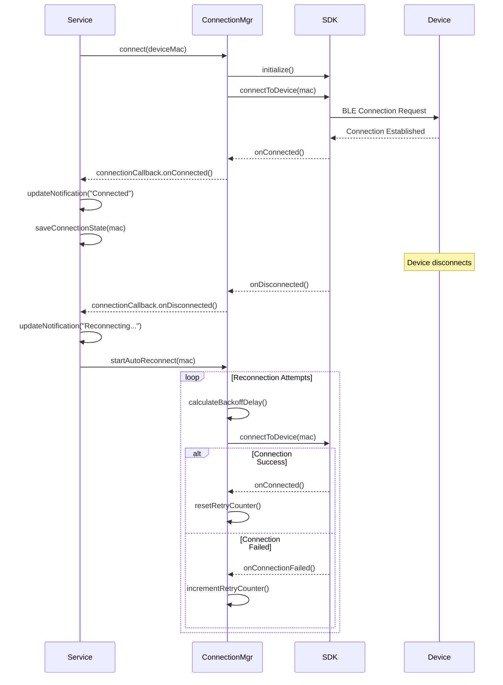

# Background Service Architecture

## Overview

The QRing Background Service is an Android Foreground Service that maintains continuous communication with the QRing smart ring device, independent of the Flutter app lifecycle. This document explains the service architecture, components, lifecycle, and implementation details.

## Architecture Components

### 1. QRingBackgroundService (Main Service)

The core foreground service that orchestrates all background operations.

**Location:** `android/src/main/java/com/example/qring_sdk_flutter/QRingBackgroundService.java`

**Key Responsibilities:**
- Manage service lifecycle (onCreate, onStartCommand, onDestroy)
- Coordinate connection management, notification updates, and command handling
- Persist and restore connection state across restarts
- Handle Bluetooth state changes
- Manage error recovery and resource cleanup

**Service Type:** Foreground Service with `connectedDevice` type (Android 12+)

**Restart Policy:** `START_STICKY` - System automatically restarts the service if killed

### 2. ServiceConnectionManager

Handles all QRing device connection logic and automatic reconnection.

**Location:** `android/src/main/java/com/example/qring_sdk_flutter/ServiceConnectionManager.java`

**Key Responsibilities:**
- Connect to QRing devices using the QRing SDK
- Monitor connection state changes
- Implement automatic reconnection with exponential backoff
- Handle Bluetooth adapter state changes
- Provide connection callbacks to the service

### 3. ServiceNotificationManager

Manages the persistent notification displayed while the service is running.

**Location:** `android/src/main/java/com/example/qring_sdk_flutter/ServiceNotificationManager.java`

**Key Responsibilities:**
- Create notification channel (Android 8.0+)
- Build and update notifications with current status
- Add action buttons (Find My Ring)
- Create pending intents for notification interactions

### 4. ServiceCommandHandler

Processes commands from notification actions and Flutter app.

**Location:** `android/src/main/java/com/example/qring_sdk_flutter/ServiceCommandHandler.java`

**Key Responsibilities:**
- Execute Find My Ring command
- Handle custom commands from Flutter
- Validate device connection before command execution
- Provide command result callbacks

### 5. NotificationActionReceiver

BroadcastReceiver that handles notification action button taps.

**Location:** `android/src/main/java/com/example/qring_sdk_flutter/NotificationActionReceiver.java`

**Key Responsibilities:**
- Receive notification action intents
- Forward actions to QRingBackgroundService
- Handle Find My Ring action

### 6. PermissionManager

Validates required Android permissions.

**Location:** `android/src/main/java/com/example/qring_sdk_flutter/PermissionManager.java`

**Key Responsibilities:**
- Check Bluetooth permissions (Android 12+)
- Check notification permissions (Android 13+)
- Validate all required permissions before service operations

## Service Lifecycle

### State Diagram

```
┌─────────────┐
│   Stopped   │
└──────┬──────┘
       │ startBackgroundService()
       ▼
┌─────────────┐
│  onCreate() │ ← Initialize components
└──────┬──────┘
       │
       ▼
┌──────────────────┐
│ onStartCommand() │ ← Create notification, connect device
└──────┬───────────┘
       │ Return START_STICKY
       ▼
┌─────────────┐
│   Running   │ ← Maintain connection, handle commands
└──────┬──────┘
       │ stopBackgroundService() or error
       ▼
┌─────────────┐
│ onDestroy() │ ← Cleanup resources, disconnect device
└──────┬──────┘
       │
       ▼
┌─────────────┐
│   Stopped   │
└─────────────┘
```

### Lifecycle Methods

#### onCreate()

Called when the service is first created.

**Actions:**
1. Initialize ServiceConnectionManager
2. Initialize ServiceNotificationManager
3. Initialize ServiceCommandHandler
4. Register Bluetooth state receiver
5. Load saved connection state from SharedPreferences

#### onStartCommand(Intent intent, int flags, int startId)

Called each time the service is started via `startService()` or `startForegroundService()`.

**Actions:**
1. Check required permissions (Bluetooth, notifications)
2. Create notification channel
3. Build and display foreground notification
4. Extract device MAC from intent extras
5. Attempt connection to device
6. Save connection state
7. Return `START_STICKY` for automatic restart

**Return Value:** `START_STICKY` - Service will be restarted if killed by system

#### onDestroy()

Called when the service is being destroyed.

**Actions:**
1. Stop automatic reconnection
2. Disconnect from device
3. Release QRing SDK resources
4. Unregister Bluetooth state receiver
5. Clear notification
6. Broadcast service stopped event to Flutter

#### onBind(Intent intent)

**Return Value:** `null` - This is a started service, not a bound service

### State Transitions

```
[Service Start] → [Permission Check] → [Create Notification] → [Connect Device]
                                ↓
                         [Permission Denied]
                                ↓
                      [Show Error Notification] → [Stop Service]

[Device Connected] → [Update Notification: Connected]
                                ↓
                      [Monitor Connection State]
                                ↓
                         [Device Disconnected]
                                ↓
                    [Update Notification: Reconnecting]
                                ↓
                      [Start Auto Reconnection]
                                ↓
                    [Exponential Backoff Retries]
                                ↓
                         [Device Reconnected]
                                ↓
                      [Reset Retry Counter]
```

## Connection Management

### Connection Flow



### Automatic Reconnection Strategy

The service implements an exponential backoff strategy for reconnection attempts:

#### Backoff Algorithm

```java
private int calculateBackoffDelay(int attemptNumber) {
    int baseDelay;
    
    if (attemptNumber <= 5) {
        baseDelay = 10000; // 10 seconds for first 5 attempts
    } else if (attemptNumber <= 10) {
        baseDelay = 30000; // 30 seconds for attempts 6-10
    } else {
        baseDelay = 60000; // 60 seconds for attempts 11+
    }
    
    // Add exponential component
    int exponentialDelay = (int) (baseDelay * Math.pow(1.5, Math.min(attemptNumber - 1, 10)));
    
    // Cap at maximum delay (5 minutes)
    int cappedDelay = Math.min(exponentialDelay, 300000);
    
    // Add jitter (±20%) to prevent thundering herd
    int jitter = (int) (cappedDelay * 0.2 * (Math.random() - 0.5));
    
    return cappedDelay + jitter;
}
```

#### Reconnection Behavior

| Attempt Range | Base Delay | Behavior |
|--------------|------------|----------|
| 1-5 | 10 seconds | Quick retries for temporary disconnections |
| 6-10 | 30 seconds | Moderate backoff for persistent issues |
| 11+ | 60 seconds | Conservative retries to save battery |
| Maximum | 5 minutes | Cap to prevent excessive delays |

**Jitter:** ±20% randomization prevents multiple devices from reconnecting simultaneously

**Reset Condition:** Successful connection resets attempt counter to 0

### Bluetooth State Handling

The service monitors Bluetooth adapter state changes:

```java
private final BroadcastReceiver bluetoothStateReceiver = new BroadcastReceiver() {
    @Override
    public void onReceive(Context context, Intent intent) {
        int state = intent.getIntExtra(BluetoothAdapter.EXTRA_STATE, -1);
        
        if (state == BluetoothAdapter.STATE_OFF) {
            // Bluetooth disabled - pause reconnection
            connectionManager.pauseReconnection();
            updateNotification("Bluetooth disabled");
        } else if (state == BluetoothAdapter.STATE_ON) {
            // Bluetooth enabled - resume reconnection immediately
            connectionManager.resumeReconnection();
            updateNotification("Reconnecting...");
        }
    }
};
```

**Behavior:**
- **Bluetooth OFF:** Pause reconnection attempts, update notification
- **Bluetooth ON:** Resume reconnection immediately (no delay)

## Notification Management

### Notification Structure

```
┌─────────────────────────────────────────┐
│  [App Icon]  Smart Ring Connected       │
│              Device: QRing-ABC123       │
│              Status: Connected          │
│                                         │
│  [Find My Ring]                         │
└─────────────────────────────────────────┘
```

### Notification States

| Connection State | Title | Description | Actions |
|-----------------|-------|-------------|---------|
| Connected | "Smart Ring Connected" | "Device: [name], Status: Connected" | Find My Ring |
| Disconnected | "Smart Ring Disconnected" | "Reconnecting... (Attempt X)" | None |
| Reconnecting | "Smart Ring Reconnecting" | "Attempting to reconnect..." | None |
| Error | "Smart Ring Error" | "[Error message]" | Open Settings |

### Notification Channel Configuration

```java
NotificationChannel channel = new NotificationChannel(
    CHANNEL_ID,
    "Smart Ring Service",
    NotificationManager.IMPORTANCE_LOW  // Persistent but not intrusive
);
channel.setDescription("Maintains connection to your smart ring");
channel.setShowBadge(false);
channel.enableLights(false);
channel.enableVibration(false);
```

**Importance Level:** `IMPORTANCE_LOW`
- Notification appears in notification bar
- No sound or vibration
- Does not peek onto screen
- Suitable for persistent background services

## Command Handling

### Command Flow

```
User Taps "Find My Ring" in Notification
         ↓
NotificationActionReceiver receives intent
         ↓
Forward to QRingBackgroundService
         ↓
ServiceCommandHandler.handleFindMyRing()
         ↓
Validate device is connected
         ↓
Execute FindDeviceReq via QRing SDK
         ↓
Update notification with result
```

### Command Validation

All commands are validated before execution:

```java
public void handleFindMyRing(CommandCallback callback) {
    if (!connectionManager.isConnected()) {
        callback.onError("NOT_CONNECTED", "Ring is not connected");
        return;
    }
    
    try {
        // Execute command via SDK
        commandHandle.executeReqCmd(new FindDeviceReq(), new CommandCallback() {
            @Override
            public void onSuccess() {
                callback.onSuccess(null);
            }
            
            @Override
            public void onError(String error) {
                callback.onError("COMMAND_FAILED", error);
            }
        });
    } catch (Exception e) {
        callback.onError("EXCEPTION", e.getMessage());
    }
}
```

## State Persistence

### Saved State

The service persists the following state to SharedPreferences:

| Key | Type | Purpose |
|-----|------|---------|
| `last_connected_device_mac` | String | MAC address of last connected device |
| `last_connection_time` | Long | Timestamp of last successful connection |
| `service_running` | Boolean | Whether service was running before shutdown |

### Persistence Flow

```java
// Save state on successful connection
private void saveConnectionState(String deviceMac) {
    SharedPreferences prefs = getSharedPreferences("qring_service", MODE_PRIVATE);
    prefs.edit()
        .putString("last_connected_device_mac", deviceMac)
        .putLong("last_connection_time", System.currentTimeMillis())
        .putBoolean("service_running", true)
        .apply();
}

// Load state on service start
private String loadSavedDeviceMac() {
    SharedPreferences prefs = getSharedPreferences("qring_service", MODE_PRIVATE);
    return prefs.getString("last_connected_device_mac", null);
}

// Clear state on manual disconnect
private void clearSavedState() {
    SharedPreferences prefs = getSharedPreferences("qring_service", MODE_PRIVATE);
    prefs.edit().clear().apply();
}
```

### Automatic Reconnection on Restart

When the service restarts (after system kill or device reboot):

1. Load saved device MAC from SharedPreferences
2. If MAC exists, attempt automatic reconnection
3. Use exponential backoff for reconnection attempts
4. Update notification with reconnection status

## Error Handling

### Error Categories

#### 1. Connection Errors
- Device not found
- Connection timeout
- Bluetooth disabled
- Device out of range

**Handling:** Automatic reconnection with exponential backoff

#### 2. Permission Errors
- Bluetooth permission denied
- Notification permission denied
- Location permission denied

**Handling:** Show error notification, stop service

#### 3. SDK Errors
- SDK initialization failure
- Command execution failure
- Unexpected SDK exception

**Handling:** Log error, attempt SDK reinitialization, continue service

#### 4. System Errors
- Low memory
- Service killed by system
- Notification channel creation failure

**Handling:** Release resources, rely on START_STICKY for restart

### Error Recovery Strategy

```java
try {
    // Execute SDK operation
    bleOperateManager.connectToDevice(deviceMac);
} catch (BluetoothException e) {
    Log.e(TAG, "Bluetooth error: " + e.getMessage());
    updateNotification("Bluetooth error - Retrying...");
    scheduleReconnect();
} catch (SecurityException e) {
    Log.e(TAG, "Permission error: " + e.getMessage());
    showPermissionErrorNotification();
    stopSelf();
} catch (Exception e) {
    Log.e(TAG, "Unexpected error: " + e.getMessage());
    reinitializeSDK();
    scheduleReconnect();
}
```

### Critical Error Handling

For unrecoverable errors:

1. Log error to logcat
2. Display error notification with action to open settings
3. Clear saved state
4. Stop service gracefully

## Battery Optimization

### Wake Lock Management

The service uses wake locks sparingly:

```java
// Acquire wake lock only during active operations
private void acquireWakeLock() {
    if (wakeLock == null || !wakeLock.isHeld()) {
        PowerManager pm = (PowerManager) getSystemService(POWER_SERVICE);
        wakeLock = pm.newWakeLock(PowerManager.PARTIAL_WAKE_LOCK, "QRing::ServiceWakeLock");
        wakeLock.acquire(10 * 60 * 1000L); // 10 minutes max
    }
}

// Release wake lock when idle
private void releaseWakeLock() {
    if (wakeLock != null && wakeLock.isHeld()) {
        wakeLock.release();
    }
}
```

**Wake Lock Usage:**
- Acquired during: Connection attempts, command execution
- Released after: Operation completes or times out
- Maximum hold time: 10 minutes (safety timeout)

### Doze Mode Compatibility

As a foreground service, the service continues running during Doze mode:

- Notification remains visible
- Connection is maintained
- Reconnection attempts continue (with backoff)
- Commands can be executed from notification

### Battery Impact

Estimated battery usage:
- Foreground service overhead: ~2-5% per day
- BLE connection maintenance: ~1-2% per day
- Reconnection attempts: Minimal (exponential backoff)
- **Total:** ~3-7% per day (acceptable for continuous connectivity)

## Performance Considerations

### Memory Usage

| Component | Approximate Memory |
|-----------|-------------------|
| Service base | 10-15 MB |
| QRing SDK | 5-10 MB |
| Notification | < 1 MB |
| **Total** | **15-25 MB** |

### CPU Usage

| State | CPU Usage |
|-------|-----------|
| Idle (connected) | < 1% |
| Active operations | 2-5% |
| Reconnection attempts | Brief spikes |

### Network Usage

- BLE only (no internet required)
- Minimal data transfer
- No background data usage

## Security Considerations

### Notification Actions

- All PendingIntents use `FLAG_IMMUTABLE` (Android 12+ requirement)
- Intents are validated before processing
- No sensitive data in notification content

### State Persistence

- Only device MAC address is stored (no sensitive data)
- SharedPreferences use `MODE_PRIVATE` (app-only access)
- State is cleared on manual disconnect

### Permissions

- Runtime permissions checked before operations
- Service stops if required permissions are denied
- Permission errors shown to user with action to grant

## Debugging

### Logcat Filters

View service logs:
```bash
adb logcat -s QRingBackgroundService
```

View all QRing-related logs:
```bash
adb logcat | grep -i qring
```

View notification logs:
```bash
adb logcat -s NotificationManager
```

### Key Log Tags

- `QRingBackgroundService`: Main service logs
- `ServiceConnectionManager`: Connection and reconnection logs
- `ServiceNotificationManager`: Notification creation and updates
- `ServiceCommandHandler`: Command execution logs
- `NotificationActionReceiver`: Notification action handling

### Debugging Commands

Check if service is running:
```bash
adb shell dumpsys activity services | grep QRingBackgroundService
```

Force stop service:
```bash
adb shell am stopservice com.example.qring_sdk_flutter/.QRingBackgroundService
```

View notification:
```bash
adb shell dumpsys notification | grep -A 20 "qring_service_channel"
```

## Testing

### Unit Tests

Located in: `android/src/test/java/com/example/qring_sdk_flutter/`

Run unit tests:
```bash
cd android
./gradlew test
```

### Integration Tests

Located in: `example/integration_test/background_service_integration_test.dart`

Run integration tests:
```bash
cd example
flutter test integration_test/background_service_integration_test.dart
```

### Manual Testing Checklist

- [ ] Service starts and shows notification
- [ ] "Find My Ring" works from notification
- [ ] Service survives app being killed
- [ ] Service restarts after system kill
- [ ] Reconnection works after disconnection
- [ ] Bluetooth off/on handling works
- [ ] Notification tap opens app
- [ ] Service stops cleanly
- [ ] Works on Android 12+
- [ ] Battery usage is reasonable

## References

- [Android Foreground Services](https://developer.android.com/guide/components/foreground-services)
- [Android Notifications](https://developer.android.com/develop/ui/views/notifications)
- [Bluetooth Permissions (Android 12+)](https://developer.android.com/guide/topics/connectivity/bluetooth/permissions)
- [Background Work Guide](https://developer.android.com/guide/background)
